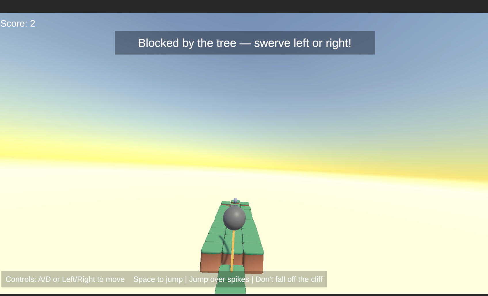
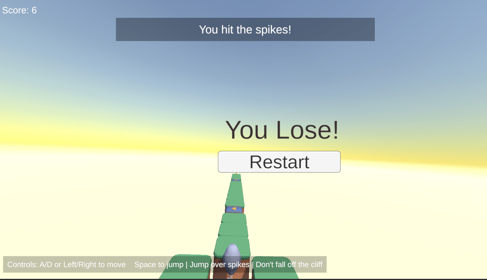

# Sky Roller 3D

Sky Roller 3D is an endless rolling-ball survival game made in Unity. The player controls a ball that automatically moves forward across procedurally generated platform sections. The goal is to survive as long as possible while avoiding falls and hazards such as trees, queues, spikes, speed boosters, and coaster launch sections.

## Screenshots

### During Play State

### Lost State

## Controls

| Action | Input |
|---|---|
| Move left | `A` or Left Arrow |
| Move right | `D` or Right Arrow |
| Jump | `Space` |

The game also displays an in-game control hint: move left/right, jump with Space, jump over spikes, and do not fall off the cliff.

## How To Run

1. Open the project in Unity.
2. Open `Assets/Scenes/GameScene.unity`.
3. Press Play.
4. Use left/right movement and jumping to survive as long as possible.

The older fixed test layout is preserved in `Assets/Scenes/GameScene_ObjectTest.unity` in case I want to test individual objects or hazards separately.

## Professor Requirements And How This Game Fulfills Them

### Easy Requirement 1: Survival Score

**Requirement:** Add a survival score based on time survived and display the survival score on the screen using UI text.

**How the game fulfills it:**

- `SurvivalScore.cs` tracks elapsed time while the game is running.
- The score is converted to whole seconds and displayed as `Score: X`.
- The score appears on the screen through a TextMeshPro UI text object.
- This gives the player a clear survival objective: stay alive as long as possible.

Relevant script:

- `Assets/Scripts/SurvivalScore.cs`

### Easy Requirement 2: Lose Condition And Restart

**Requirement:** Add a lose condition when the player falls off the platforms and add a restart option after the player loses.

**How the game fulfills it:**

- `DeathZone.cs` detects when the player falls below the platform path.
- The death zone follows the player on the Z axis during endless generation, so falling is still detected even when the level is procedurally extended.
- When the player hits the death zone, the game shows the Game Over UI and pauses time.
- `GameOverUI.cs` includes a restart function that reloads the active scene and resets `Time.timeScale`.
- The Lost State screenshot above shows the game over panel and restart flow.

Relevant scripts:

- `Assets/Scripts/DeathZone.cs`
- `Assets/Scripts/GameOverUI.cs`

### Medium Requirement: At Least Three Hazard Types

**Requirement:** Add at least three different hazard types besides falling off the platform. Hazards must make the player lose or affect the player's movement or control.

**How the game fulfills it:**

This game includes five hazard or effect types besides falling:

| Hazard / Object | Effect |
|---|---|
| Tree | Blocks the center path, so the player must swerve left or right around it. |
| Coaster | Launches the player upward and gives a forward boost. |
| Queue Entrance | Slows the player down while inside the queue trigger. |
| Speed Booster / Conveyor Belt | Temporarily increases the player's forward speed. |
| Spike Trap | Kills the player when the player touches the spike trap, encouraging the player to jump over it. |

The game also shows effect notifications when special objects are touched, such as speed boost, slow down, spike hit, tree block, and coaster launch.

Relevant scripts:

- `Assets/Scripts/TreeBlocker.cs`
- `Assets/Scripts/CoasterLaunchZone.cs`
- `Assets/Scripts/SlowZone.cs`
- `Assets/Scripts/SpeedBoostZone.cs`
- `Assets/Scripts/SpikeHazard.cs`
- `Assets/Scripts/EffectNotificationUI.cs`

### Hard Requirement: Endless Procedural Platform Generation

**Requirement:** Create an endless procedural platform generation system.

**How the game fulfills it:**

- `PlatformGenerator.cs` spawns platform sections ahead of the player as the player moves forward.
- It tracks active platform sections in a queue.
- It destroys old platform sections behind the player so the scene does not keep filling up forever.
- It randomly chooses from multiple section prefabs and avoids spawning the same prefab twice in a row.
- Spawned sections are organized under a `GeneratedLevel` parent object at runtime.

Relevant scripts:

- `Assets/Scripts/PlatformGenerator.cs`
- `Assets/Scripts/PlatformSection.cs`

### Hard Requirement: At Least Four Platform Prefabs

**Requirement:** Create at least four different platform prefabs for the generator to use.

**How the game fulfills it:**

The generator uses seven section prefabs located in `Assets/Prefabs/PlatformSections/`:

| Prefab | Purpose |
|---|---|
| `Section_Straight.prefab` | Basic straight path section. |
| `Section_Wide.prefab` | Wider section with left, center, and right lanes. |
| `Section_Queue.prefab` | Section with queue entrance slow hazard. |
| `Section_Tree.prefab` | Section with tree blocker and side paths. |
| `Section_SpeedBoost.prefab` | Section with conveyor speed booster. |
| `Section_Spikes.prefab` | Section with spike trap hazard. |
| `Section_CoasterLaunch.prefab` | Section with coaster upward launch hazard. |

An editor utility, `CreatePlatformSectionPrefabs.cs`, can recreate these prefabs if needed.

## Complete Gameplay Loop

The game includes a complete endless gameplay loop:

1. The player starts on generated platforms.
2. The ball automatically rolls forward.
3. The player steers left/right and jumps when needed.
4. The camera follows the player.
5. New platform sections spawn ahead.
6. Old platform sections are removed behind the player.
7. The player reacts to hazards and effect objects.
8. The survival score increases over time.
9. If the player falls or hits a lethal hazard, the game enters the lost state.
10. The player can restart and try again.

## Main Scripts

| Script | Purpose |
|---|---|
| `PlayerMovement.cs` | Forward movement, side movement, jump, speed boost, slow effect, coaster launch, tree blocking support. |
| `CameraFollow.cs` | Keeps the camera following the player. |
| `SurvivalScore.cs` | Tracks and displays survival time. |
| `GameOverUI.cs` | Shows game over panel and restarts scene. |
| `DeathZone.cs` | Detects falling and follows player during endless generation. |
| `PlatformGenerator.cs` | Spawns/despawns endless platform sections. |
| `PlatformSection.cs` | Stores each section's length. |
| `SlowZone.cs` | Slows the player in queue entrance sections. |
| `SpeedBoostZone.cs` | Boosts player speed on conveyor sections. |
| `CoasterLaunchZone.cs` | Launches the player upward. |
| `TreeBlocker.cs` | Blocks forward movement until player swerves around the tree. |
| `SpikeHazard.cs` | Causes loss when the player touches spikes. |
| `EffectNotificationUI.cs` | Displays temporary hazard/effect notification messages. |
| `ControlHintUI.cs` | Displays persistent control instructions. |

## Assets

This project uses Kenney-style amusement park/platform assets included in the project under `Assets/Sprites/FBX/`.
